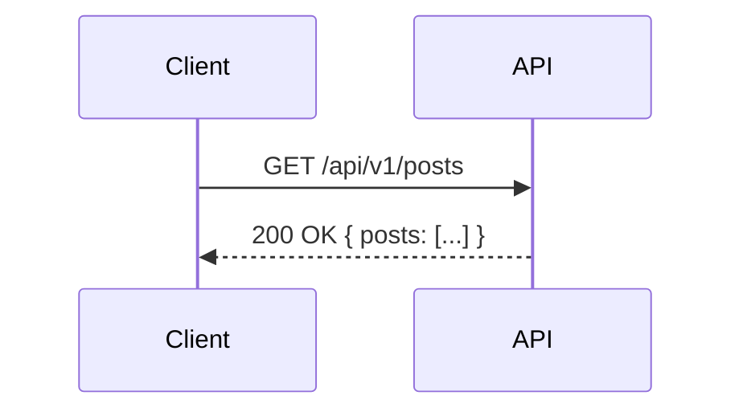

# SPECIFICATION.md テンプレート

`.artifacts/features/<feature>/SPECIFICATION.md` を以下の構成で作成する。

````md
---
feature: <feature_name>
last_updated: YYYY-MM-DD
---

# 技術仕様: <feature_name>

## 1. 技術スタック

- **言語 / ランタイム**:
- **主要ライブラリ / フレームワーク**: （バージョン制約を含む）
- **データベース / ストレージ**:
- **外部サービス / API**:

## 2. アーキテクチャ

- **全体構造**: （例: レイヤードアーキテクチャ、クリーンアーキテクチャ、シンプル MVC）
- **データフロー**:

  ```text
  入力 → 処理 → 永続化 → 出力 のパス
  ```

- **提案するディレクトリ構成**:

  ```text
  src/
  ├── components/    # UI コンポーネント
  ├── hooks/         # カスタムフック / 共有ロジック
  ├── services/      # 外部 API クライアント / DB アクセサ
  ├── types/         # 型定義
  └── utils/         # ユーティリティ関数
  ```

## 3. データモデル / スキーマ

- **エンティティ / テーブル定義**:
  - （例）`User`: { id, name, email, role: 'admin'|'user', createdAt }
- **型定義**:
  - 実装全体で共有する主要な `interface` / `type` 宣言。
- **バリデーションルール**:
  - フィールドごとの制約（必須・長さ制限・正規表現など）。

## 4. インターフェース仕様

- **API エンドポイント / 関数シグネチャ**:
  - `GET /api/v1/posts`: 投稿一覧取得（クエリパラメータ: limit, offset, status）
  - `POST /api/v1/posts`: 新規投稿作成（リクエストボディ構造を記載）
- **状態管理**:
  - グローバル状態とローカル状態の切り分けを定義する。

## 5. UI/UX コンポーネント（該当する場合）

- **主要コンポーネント一覧**:
  - `PostList`: 記事一覧を描画する親コンポーネント。Props: `posts: Post[]`
- **画面遷移 / インタラクション**:
  - ローディング状態、成功 / 失敗時の挙動など。

## 6. テスト戦略

- **単体テスト対象**:
  - 計算ロジック、状態遷移ロジックなど。
- **ハッピーパス / エラーパスの定義**:
  - ハッピーパス: 必須フィールドすべて入力 → 保存成功。
  - エラーパス: 重複 ID → 保存失敗、ネットワークエラー → リトライ挙動。
- **検証コマンド**:
  - 例: `npm run test:unit`、または手動 API テスト用の `curl` コマンド例。

## 7. 非機能要件

- **セキュリティ**: 認証トークン管理・入力サニタイズ・最小権限の原則。
- **パフォーマンス**: 仮想スクロール・画像リサイズ・キャッシュ戦略。
- **スケーラビリティ**: 水平スケーリングの可否・ステートレス設計の範囲。
- **保守性**: 一貫したパターン・テスタビリティ・明確なコード構成。

## 8. トレードオフ分析

重要な設計決定ごとに記載する。

| 決定事項 | 選択したアプローチ | 検討した代替案 | 根拠 |
| --- | --- | --- | --- |
| [テーマ] | [選択] | [他の選択肢] | [理由] |

## 9. 図

該当する場合は Mermaid 図を作成する。


````
